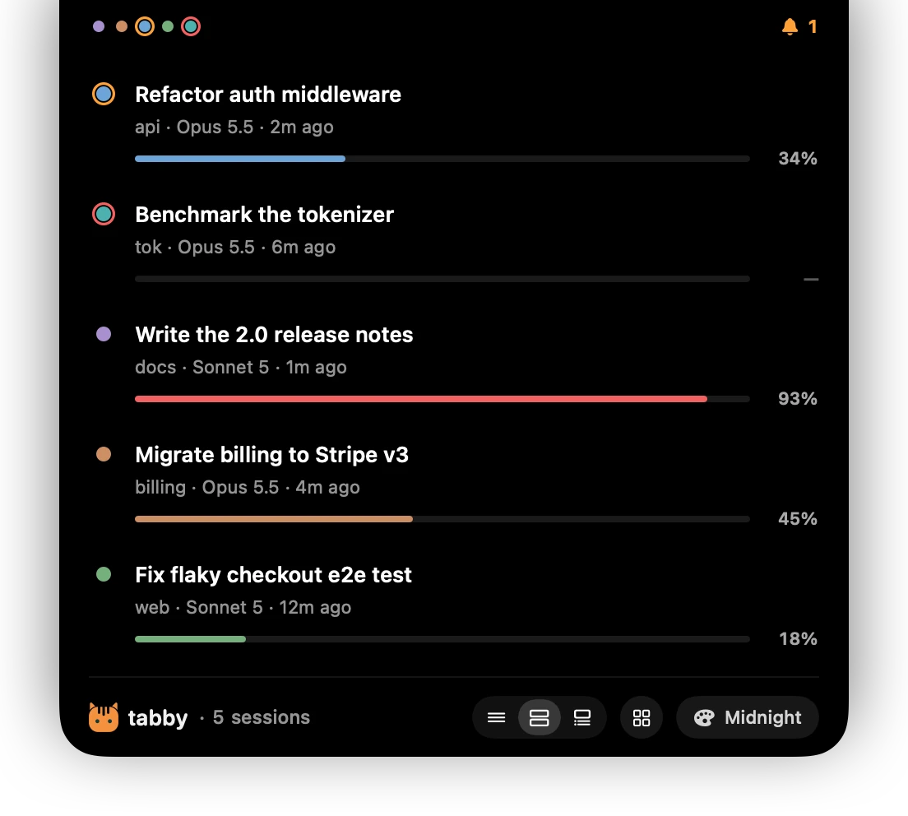
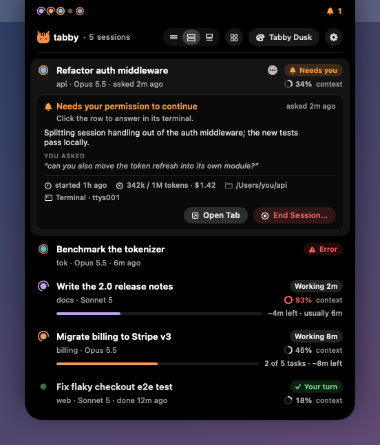
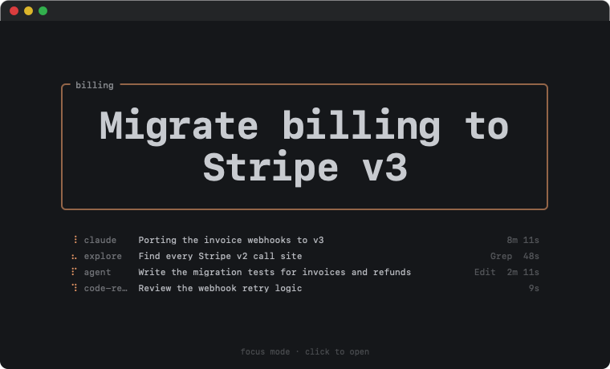
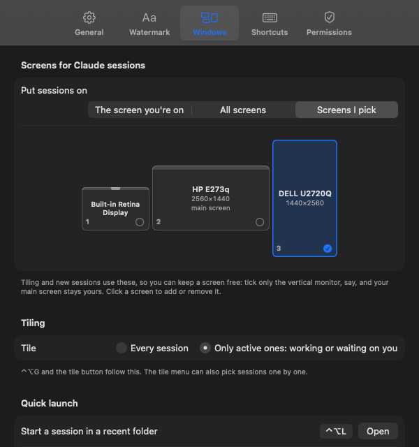
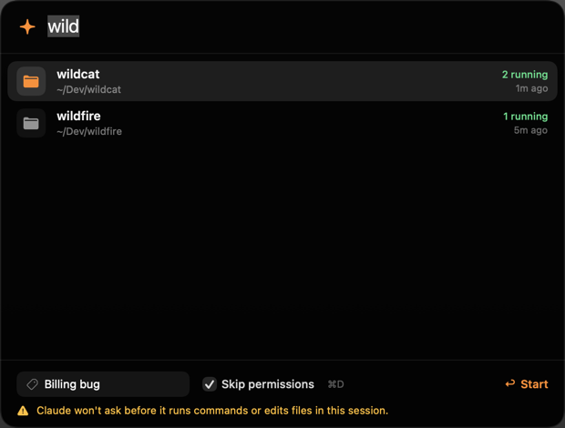

<p align="center">
  
</p>

<h1 align="center">tabby</h1>

<p align="center"><b>Every Claude Code tab, at a glance.</b><br>
An AI-written name, a calm color and a live status for every Claude Code session,<br>
and a Mac island that shows them all. Free, local and open source.</p>

<p align="center">
  <a href="https://github.com/0xNtive/tabby/actions/workflows/ci.yml"></a>
  <a href="https://github.com/0xNtive/tabby/releases/latest"></a>
  <a href="LICENSE"></a>
  
  
</p>

<p align="center"><a href="https://claude-tabby.vercel.app">Website</a> · <a href="#install">Install</a> · <a href="#use-it">Commands</a> · <a href="#tabby-island">Island</a> · <a href="#troubleshooting">Troubleshooting</a> · <a href="CONTRIBUTING.md">Contributing</a></p>

<p align="center"></p>

```
🟢 ✳ Stripe Webhook Retries    🔵 ◐ Dark Mode Settings    🟣 🔔 Flaky Auth Tests    🟠 ✳ Release Notes
```

With five Claude sessions running, every tab looks the same. tabby gives each one:

- **a name** that Claude Haiku writes from what you're doing, in about 2 s;
- **a color**, with a background tinted to match, different from your other open sessions;
- **a live status** in the title: `◐` working (animated), `✳` your turn, `🔔` needs you (blinking);
- **one-line control** with `/tab`, launch flags and keyboard shortcuts.

On a Mac, **Tabby Island** lists every session at the top of your screen. It can also hide what Claude writes in the windows you're not using (Focus mode), tile sessions across the screens you choose, and start a new session in a recent folder with one shortcut.

## Install

**Paste this into Claude Code** and let Claude do it:

```
Install tabby for me: run `curl -fsSL https://claude-tabby.vercel.app/install.md` and follow it.
```

Claude shows you the [terms](TERMS.md) (short version: local, free, no telemetry), installs tabby, checks every piece with `tabby doctor` and walks you through the Mac permissions. It handles what gets in the way on its own: no Node.js, no Xcode, no git, or a terminal other than Terminal.app.

Or in a terminal:

```sh
curl -fsSL https://claude-tabby.vercel.app/install | bash
```

Or with Claude Code's plugin commands:

```
/plugin marketplace add 0xNtive/tabby
/plugin install tabby@tabby
/reload-plugins
/tabby:setup
```

All three need Claude Code on macOS or Linux, and take about 15 seconds. Then open a new Claude session: its tab gets a name and a color after your first prompt.

<details>
<summary><b>What setup changes</b> (all of it reverts with <code>tabby uninstall</code>)</summary>

| What | Why |
|---|---|
| `CLAUDE_CODE_DISABLE_TERMINAL_TITLE=1` in `settings.json` (backed up first) | tabby draws the title (color marker, animated status) instead of Claude |
| a `statusLine`, only if you don't have one | name, color and context used inside Claude |
| `~/.claude/commands/tab.md` | the short `/tab`; plugin commands are namespaced as `/tabby:tab` |
| a 3-line block in `~/.zshrc` / `~/.bashrc` | the `claude --tab --color --theme` flags and the `tabby` command |
| Terminal.app: each Claude tab uses a "<profile> · tabby" copy of its profile while it runs | windows and tabs read `🔵 ◐ Dark Mode Settings`, not `api — 🔵 ◐ Dark Mode Settings — caffeinate ◂ claude --dangerously-skip-permissions — 80×24` |
| `~/.claude/tabby/bin/` | a launcher that runs the newest installed copy with a Node.js it finds wherever it lives |
| `~/.claude/tabby/node/`, only if you have no Node.js 18+ | a private Node.js 22 (checksum-verified) that only tabby uses |
| `~/Applications/Tabby Island.app` and a login item (macOS) | the island, downloaded ready-made from the [latest release](https://github.com/0xNtive/tabby/releases/latest) |

Other ways: from a checkout, `git clone https://github.com/0xNtive/tabby && node tabby/bin/tabby.js install`. For one session only, `claude --plugin-dir ./tabby`.
</details>

Something not working? Ask Claude to **"fix tabby"**, or run `tabby doctor`.

### Updating

When a new version is out, the island shows an **Update** button, and a new Claude session mentions it once a day. Update from wherever you are:

- **In the island:** click **Update** at the top (or **Update to tabby x.y.z…** in its menu-bar menu, or Settings › General › Updates). The island restarts on the new version.
- **In Claude:** `/tab update` (it runs in the background).
- **In a terminal:** `tabby update`, or `tabby update --check` to only look.

An update gets the plugin, refreshes the parts of setup you have (nothing you turned off comes back) and Tabby Island. Afterwards, type `/reload-plugins` in the sessions that were already open.

## Use it

In Claude. `/tab` is answered by a hook, so it's instant and never costs tokens.

```
/tab Auth refactor           rename (pauses AI naming)     /tab auto       back to AI names
/tab color teal              red orange yellow green teal blue purple pink · next · #hex
/tab theme nord              this tab                      /tab theme nord all   every tab
/tab ls                      every session: status, context, summary
/tab note waiting on design  a note shown in the island
/tab tile active             tile the sessions that are working or need you
/tab focus-mode on           cover the Terminal windows you're not in while Claude works
/tab watermark off           hide the watermarks (on brings them back)
/tab update                  get the newest tabby, in the background
/tab reset · /tab off · /tab on · /tab themes · /tab colors
```

At launch:

```sh
claude --tab "Auth refactor" --color teal --theme nord
claude -n "Auth refactor"                       # Claude's own flag works too; so does /rename
tabby new api -n "API" --dangerous              # a new window in your recent "api" folder, permissions skipped
```

Anywhere:

```sh
tabby ls                  # every running session: name, status, context %, summary
tabby next                # jump to the next session that needs you
tabby focus 2             # jump to session 2
tabby tile 4              # 2, 3, 4, 6 or 8 session windows, on the screens you chose
tabby tile --active       # only the sessions working or waiting on you (--only 1,3,auth to pick)
tabby tile screens        # list your displays; tabby tile screens 2 puts sessions on display 2
tabby new --list          # recent and frequent folders, best first
tabby themes              # preview all 57 themes
tabby doctor              # check every part of the install, with the fix for each
tabby update              # the newest tabby: plugin, setup and island (--check to only look)
```

## Tabby Island

A Dynamic-Island-style overlay at the top center of your Mac. It idles under 1% CPU.

- **Collapsed:** one dot per session. A working session's dot spins inside a ring of its color, one that needs you rings amber, and one waiting for your next prompt rests, dimmed. A short announcement pops up when a session finishes or needs you.
- **Open** (hover, or ⌃⌥Space): every session's name and status ("Working 3m", "Your turn", "Needs you"), context used, and for a working session, an estimate of how far along it is. That estimate is "2 of 5 tasks · ~3m left" from Claude's task list, or "~2m left · usually 6m" from how long that session's turns take.
- **Hover a session** for the full picture: what it's doing or waiting for, and what to do about it; its current task, summary, your last prompt, tokens and cost, folder and terminal. **Open Tab** jumps there. **End Session…** stops Claude and closes its tab, but only after you confirm; `claude --resume` brings the conversation back.
- **Modes:** Minimal (one line per session), Standard, and Detailed (summary, last prompt, tokens and cost for every session).
- **Watermark:** each Terminal.app session's topic in large, faint letters over its window, in the session's color. Clicks and typing go straight through.
- **Settings** (the cog, ⌃⌥, or the menu-bar icon): the island, tab names, tint, markers, themes, the watermark, Focus mode, screens and tiling, shortcuts and permissions.

<table>
<tr>
<td width="50%"></td>
<td width="50%"></td>
</tr>
<tr>
<td><b>Hover:</b> what a session needs, at a glance.</td>
<td><b>Focus mode:</b> just the topic and what's running.</td>
</tr>
</table>

### Focus mode

With several sessions running, their scrolling output competes for your eyes. Turn on Focus mode (Settings › Focus, the menu-bar menu, or `/tab focus-mode on`), and while Claude works, every Terminal window you're not in shows only its topic in a big box. Below it, one line per running agent (Claude and each subagent) has a small spinner, what it's doing and for how long. A window opens again as soon as Claude needs you or it's your turn, and the window you're typing in is never covered. Click a covered window to go to it.

### Tiling across your screens

⌃⌥G (or the tile button) fills the screen with session windows, and tabs become windows. Choose which screens get them in **Settings › Windows**: the screen you're on, all of them, or the ones you pick. Pick only your vertical monitor, for example, and your main screen stays free. Sessions spread across the chosen screens by size, and a portrait screen stacks them in rows. Tile every session, only the active ones (working or waiting on you), or pick them with checkboxes from the tile menu.

### Quick launch

⌃⌥L opens a launcher with your recent and most-used project folders. Type to filter, add a name if you like, and press Enter: a new window opens there, running Claude, on your chosen screen. Tick **Skip permissions** (⌘D) to start it with `--dangerously-skip-permissions`; it remembers your choice and warns you while it's on.

<table>
<tr>
<td width="50%"></td>
<td width="50%"></td>
</tr>
<tr>
<td><b>Screens:</b> keep the main one free.</td>
<td><b>Quick launch:</b> a session in two keystrokes.</td>
</tr>
</table>

### Shortcuts

All of them can be changed in Settings › Shortcuts.

| Shortcut | Action |
|---|---|
| ⌃⌥Space | open the island with the keyboard (↑↓ ↩, esc) |
| ⌃⌥N | next session that needs you |
| ⌃⌥1–9 | jump to a session |
| ⌃⌥L | new session in a recent folder |
| ⌃⌥G | tile windows |
| ⌃⌥M | switch mode |
| ⌃⌥W | watermark on or off |
| ⌃⌥, | Settings |

### Permissions

The island asks macOS only for what your terminal needs, and its setup window checks each permission live, with **Allow All** to ask for them in turn:

- **Terminal.app:** Accessibility (tiling splits tabs into windows), Control Terminal (jump to a tab, the watermark, Focus mode), Control System Events (tiling).
- **iTerm2:** Accessibility and Control iTerm2.
- **VS Code, Cursor, Ghostty, Warp and others:** nothing at all.

`tabby island permissions` (or **Setup & Permissions…** in its menu) opens that window again. `tabby island` starts the island, `tabby island install` reinstalls it, and `tabby island login --off` stops it opening at login.

## Colors that don't hurt

- **Contrast stays fixed.** A session's background is its theme's background, shifted toward the session color in OKLCH at the same lightness, so text contrast doesn't move. tabby also never lets a tint make text less readable than the theme itself.
- **Every theme is WCAG AA or better,** and cursors stay at 3:1 or more. Tests enforce both, and the numbers are in the [contrast audit](docs/contrast.md).
- **Claude's own UI stays legible.** Claude Code draws its own colored text (dim gray, suggestions, its orange, diffs). 30 themes keep at least 80% of its intended contrast, including all five of tabby's own; they're marked ✓ in the audit, and automatic theme variety only uses them.
- **Match the mode.** Claude's dark theme (the default) draws white text, and its light theme black. With a light tabby theme, switch Claude to light with `/theme`. tabby warns you if they don't match.
- **No two open sessions share a color.** A project gets its last color back when that color is free.
- **57 themes in six groups:**
  - **Signature:** Tabby Dusk, Midnight, Ember, Paper, Mist.
  - **Calm:** Nord, Everforest, Kanagawa, Rosé Pine, Catppuccin Frappé and Macchiato, Flexoki, Iceberg, Selenized, Gruvbox Material and more.
  - **Classic:** Catppuccin Mocha, Tokyo Night, Gruvbox, One Dark, Oxocarbon, Poimandres and more.
  - **Vivid**, **Light** and **High contrast** (Modus).

| Command | Effect |
|---|---|
| `/tab strength subtle\|medium\|bold` | tint intensity |
| `tabby config auto themes` | a different theme per session |
| `tabby config animate false` | turn off the title spinner and bell |

## Terminal support

| | title | background | tab color | jump to tab | tile |
|---|---|---|---|---|---|
| Terminal.app | ✓ only the name ([how](#how-it-works)) | ✓ (bold text too) | emoji marker | ✓ | ✓ (tabs → windows with Accessibility) |
| iTerm2 | ✓ | ✓ | ✓ native, pulses when waiting | ✓ | ✓ |
| Ghostty, WezTerm, kitty, Alacritty | ✓ | ✓ | emoji marker | – | – |
| VS Code / Cursor | ✓ with `"terminal.integrated.tabs.title": "${sequence}"` | ✓ | emoji marker | – | – |
| tmux | window name | pane style | status-bar color | ✓ | – |

The watermark and Focus mode cover Terminal.app windows.

## Troubleshooting

In Claude, **"fix tabby"** runs `tabby doctor --json` and works through whatever it finds. By hand:

```sh
tabby doctor                              # every check, with the fix for each
sh ~/.claude/tabby/bin/tabby doctor       # the same, in a shell without the tabby command
```

| What you see | What to do |
|---|---|
| A tab has no name or color | That session started before tabby: `/reload-plugins` in it, or restart it (`claude --continue` keeps the conversation). `tabby adopt` colors it now. |
| The island shows no sessions | Same: only sessions started after the install are tracked. |
| No macOS permission prompt | `tabby island permissions`, then **Allow**. It starts the app it asks about first, so macOS can prompt. **Ask Again** resets an earlier "Don't Allow". |
| `tabby needs Node.js 18` | Run the installer again: it sets up a private Node.js. |
| The island isn't there | `tabby island`. If it isn't installed, `tabby island install`. It needs macOS 14 or newer. |

Running the installer again is always safe: it repairs in place. Logs are in `~/.claude/tabby/install.log` and `~/.claude/tabby/tabby.log`.

## How it works

- **Hooks.** `SessionStart`, `UserPromptSubmit`, `Stop`, `Notification`, `PermissionRequest`, `PostToolUse` and `SessionEnd` keep `~/.claude/tabby/sessions/<id>.json` up to date. They write OSC escape codes straight to the session's TTY. Everything after the prompt is an async hook; the per-tool fast path is a ~10 ms shell script. Hooks start through `bin/tabby.sh`, which finds a Node.js wherever it lives, so Claude started from the Dock or an editor works too.
- **Names.** A background `claude -p --safe-mode --model haiku` call (thinking off, no hooks, plugins or MCP) returns a 2–4 word title and a one-line summary. It's handed back to Claude via the hook `sessionTitle` field, so `/resume` shows it too. `tabby config namer heuristic` names tabs with no model call.
- **Animation.** While a session works or waits, one small background process redraws those titles about 6 times a second, then exits a minute after everything is idle.
- **Status** comes from the hooks, plus Claude's own session registry. **Context** comes from the status line, or else from the transcript. **Subagents** (for Focus mode) come from each session's `subagents/` transcripts.
- **Terminal.app titles.** Terminal adds the folder, process, arguments and size to every title, and reads its title settings only at launch. So while a session runs, its tab uses a copy of its own profile ("Basic · tabby") with just those title parts turned off. `tabby terminal-titles off` puts the tabs back and deletes the copies.
- **The island** is a native SwiftUI + AppKit app. It reads `~/.claude/tabby` and Claude's registry, and runs the tabby CLI for anything that changes state. Each [release](https://github.com/0xNtive/tabby/releases) ships it universal (Apple silicon and Intel) with a SHA-256 checksum, and the installer rejects a download that doesn't match.
- **Exit.** On exit a tab gets its profile colors back (`OSC 110/111/112`), and in Terminal.app its own profile; `/clear` keeps its identity.

## Privacy, cost and terms

- **Nothing about you leaves your machine except the naming request,** which goes to Claude Haiku through your own Claude Code login: about 500 tokens (roughly $0.001), covered by Pro and Max.
- **Update checks** ask github.com where tabby's latest release is, every 6 hours at most: a plain request that sends nothing about you. `tabby config updateCheck false` (or Settings › General) turns them off.
- **No servers, no telemetry.**
- tabby is free. Future versions may show clearly labeled sponsored messages in tabby's own UI, never in your prompts, conversations or model context. See the [Terms of Use](TERMS.md), which setup asks you to accept.
- tabby is an independent project, **not affiliated with Anthropic**. Claude is a trademark of Anthropic.

## Contributing

tabby is open source under the [MIT license](LICENSE), and contributions are welcome: bug reports (the form asks for `tabby doctor` output), themes, terminal support, and ideas for working with many sessions at once.

```sh
npm test                 # node --test, zero dependencies
npm run export           # regenerate docs/contrast.md and site/themes.json from lib/themes.js
bash island/build.sh     # build the island (Xcode Command Line Tools); bash island/test.sh checks it
"island/build/Tabby Island.app/Contents/MacOS/TabbyIsland" --snapshot /tmp/snaps   # render every island screen to PNGs
claude --plugin-dir .    # try local changes in one session
```

[CONTRIBUTING.md](CONTRIBUTING.md) explains how the pieces fit, how to test the installer in a throwaway home, and how releases work. Please read the [Code of Conduct](CODE_OF_CONDUCT.md), and report security issues privately ([SECURITY.md](SECURITY.md)). What changed and when is in the [changelog](CHANGELOG.md).

MIT © 2026 tabby contributors
